# むびレコ

## **どんなアプリ？**
* 鑑賞した映画を記録するアプリです。

## **何故、このアプリ？**
* こちらのアプリを作成した経緯は、趣味が映画鑑賞なのですが、今まで鑑賞した映画を記録しておらず、
記憶が曖昧でした。映画を語る上でやはり、詳しくなっておく必要があると思い、こちらを作成して
みました。また、Webで映画を記録するシンプルなWebアプリが存在しないのも、作成した経緯です。

* Rails学習の為に作成しました。

## **作成期間はどれくらい？**
およそ1ヶ月程度です。

## インフラ構成図

.png)

## **使用技術は？**
- 使用技術
    - バックエンド
        - 

            
        

    - フロントエンド
      - 

            
        

    - その他
        - 

              
                
                
                
        

## **実装一覧**
-  基本的なCRUD処理の実装
-  RSpecを利用したコードの担保
-  CI/CDの採用
-  AWS/Fargate&ECSでのデプロイ
-   jwtを用いたログイン認証
-  複数のモデルを跨いだクエリインターフェースの実装
- 各種コンポーネントライブラリーを使用した機能の実装
    - オートサイズテキストボックス
        - https://github.com/devstark-com/vue-textarea-autosize
    - マルチセレクトボックス
        - https://github.com/shentao/vue-multiselect
    - ★テキストフィールド
        - https://github.com/craigh411/vue-star-rating?ref=kabanoki.net

- 外部API連携の実装

## 機能イメージ
ウェルカムページ
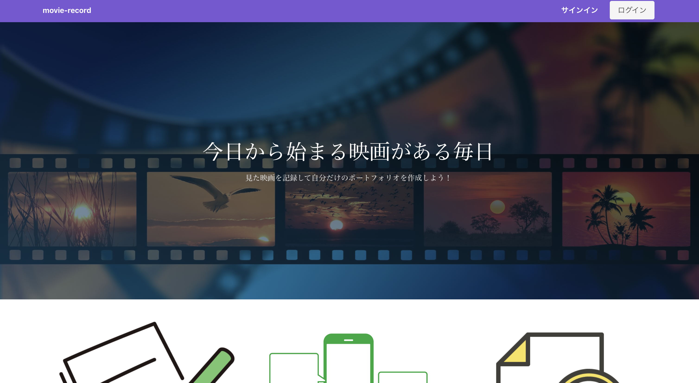

ログインページ
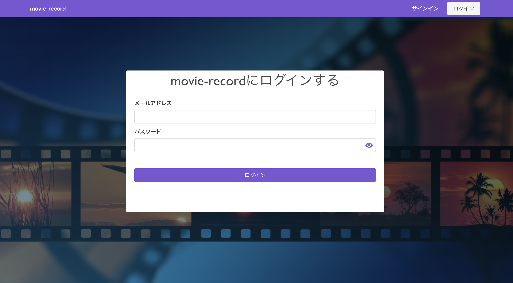

トップ画面
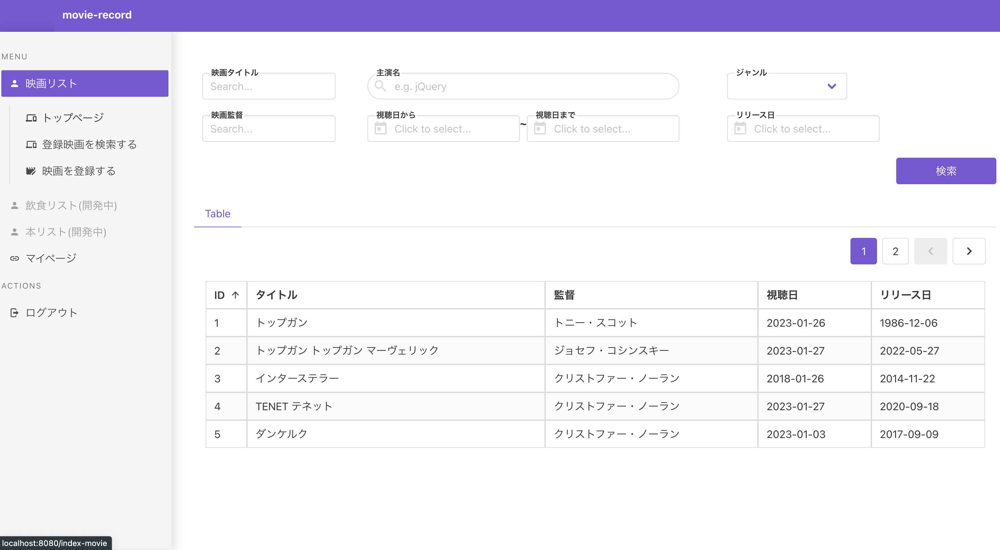

登録映画詳細ページ
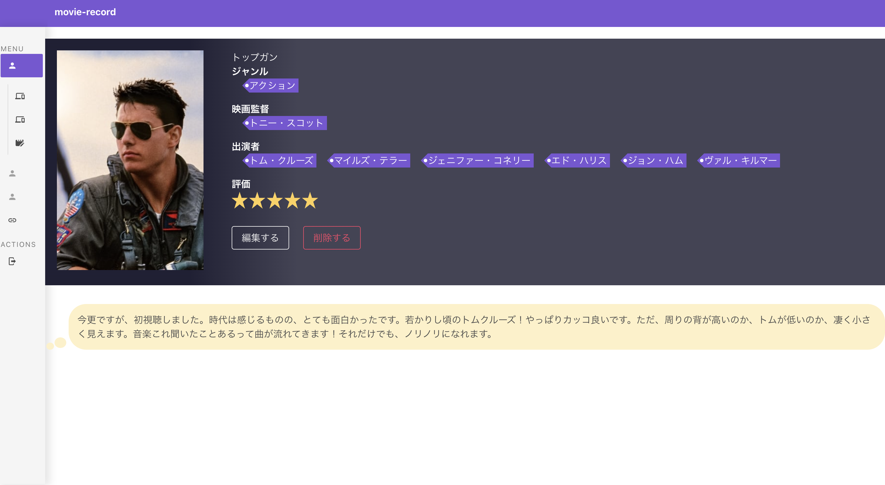

登録映画編集ページ
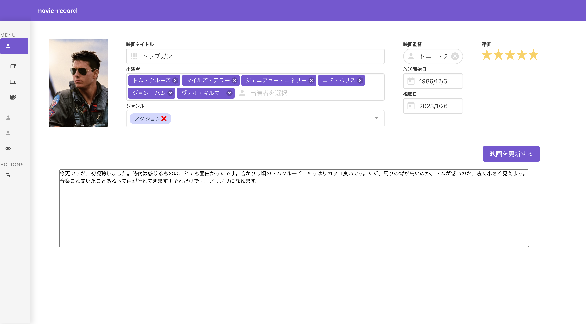

鑑賞映画登録ページ
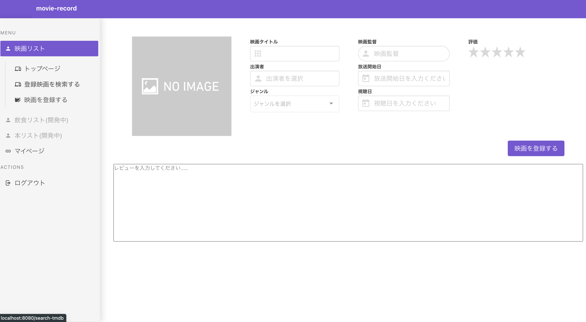

登録映画検索ページ
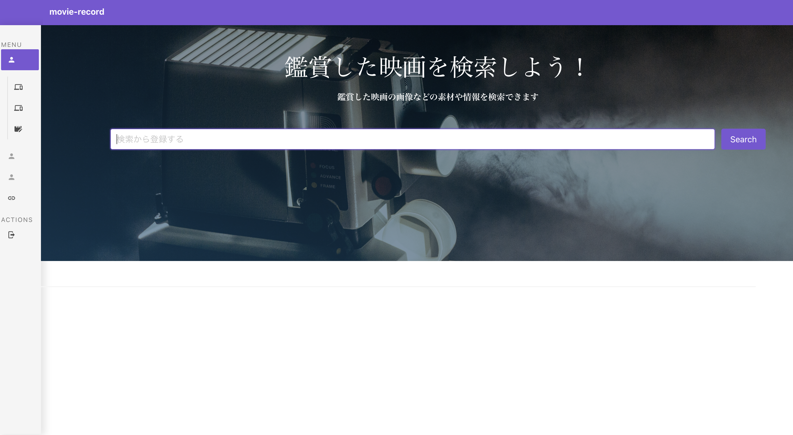

登録映画検索後ページ

各種コンポーネントUI

ダイアログコンポーネント
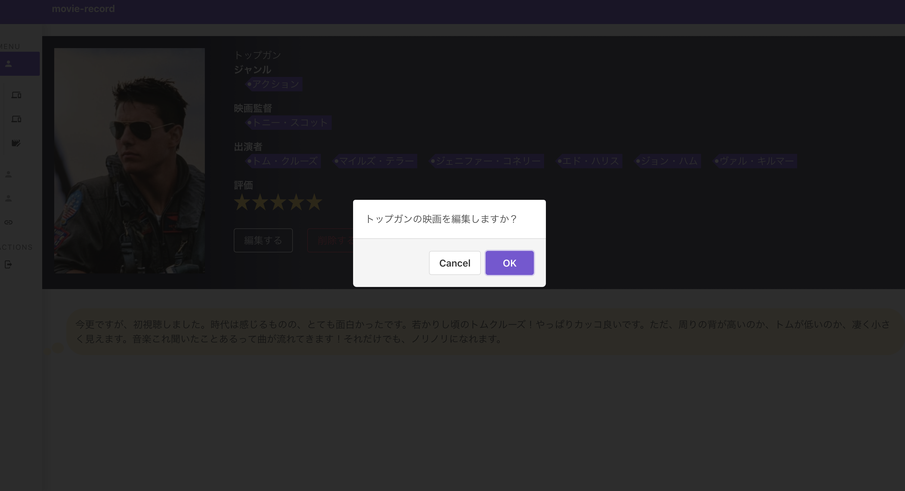

マルチセレクトコンポーネント
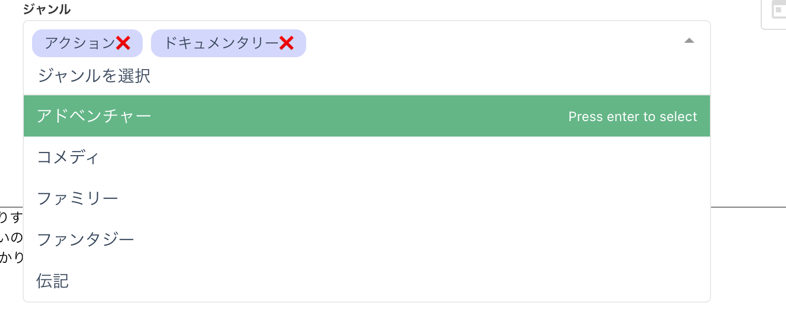
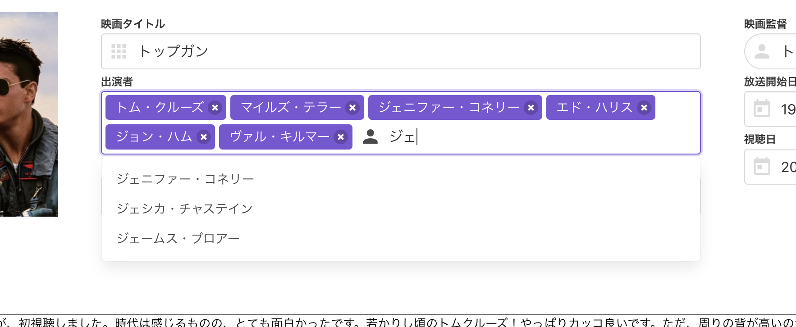

ページネーションコンポーネント
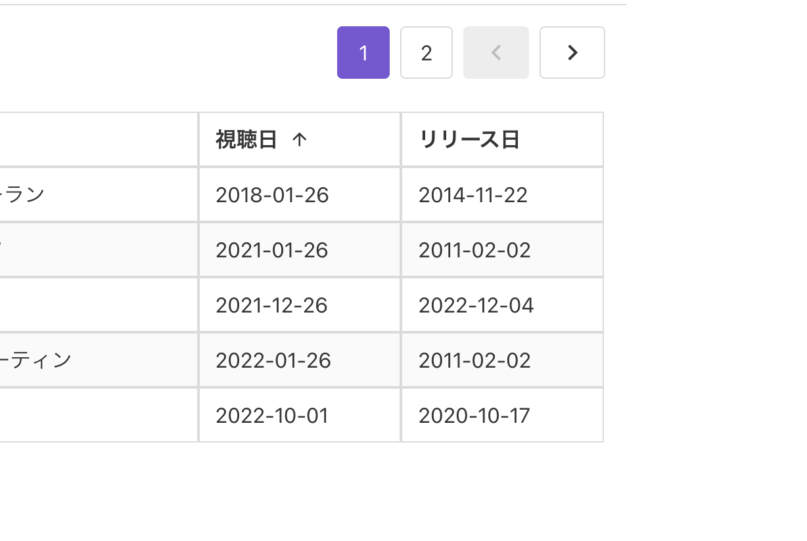

## DB設計
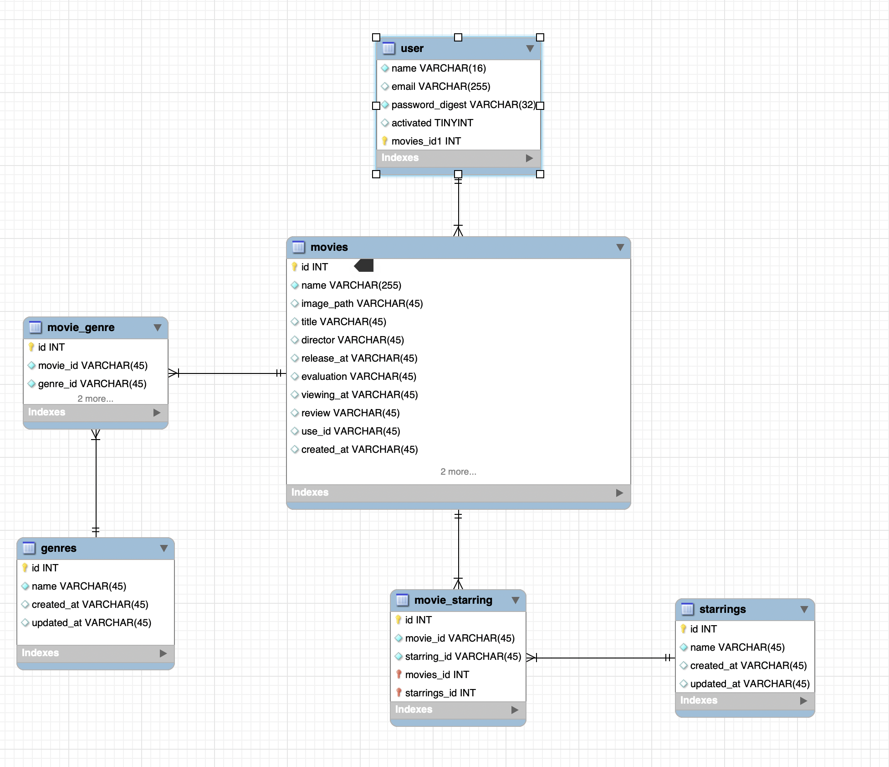

### 各テーブルについて

| テーブル名 | 説明 |
|:-:|:-:|
| users  | 利用者情報  |
| movies  | 映画情報  |
|  movie_genre | 映画とジャンルの中間テーブル情報  |
| genres  | ジャンル情報  |
| starrings  | 俳優情報  |
| movie_starring  | 映画と俳優の中間テーブル情報  |

### 実装で苦労した点は？

実装で苦労した点は、３点あります。 
- まずは、jwtを使用したログイン認証です。
jwt認証を採用した理由としては、今回はSPAで開発している為
jsonとの親和性が高い事から、jwt認証を採用しました。また、
以前までは学習用でdeviseしか認証関連を実装してきませんでしたので、
どうしても、認証に関してブラックボックス化していた事が上がられます。
そのような中で、jwt認証に関して実装されている参考サイトを拝見しながら実装させていただきましたが、実装に苦労しました。
ただ、今までjwt認証に限らず、認証によるセキュリティ対策についてより一層理解する事で勉強に
なったと思います。

- デプロイ関連です。

- railsでのコーディングです。
実務においては、PHPフレームワークであるLaravelを使用してきたのですが、
今回は実務では経験がなく、Railsで実装しており、Laravelとの書き方の違い
に苦労しました。ただ、コーディングしていく内にRubyの書きやすさに驚きを
感じました。また、今回はコードの整合性を確認するためにも、Railsに精通している
方にAPI側のコードレビューだけ、mentaというサービスを利用してやっていただきました。

